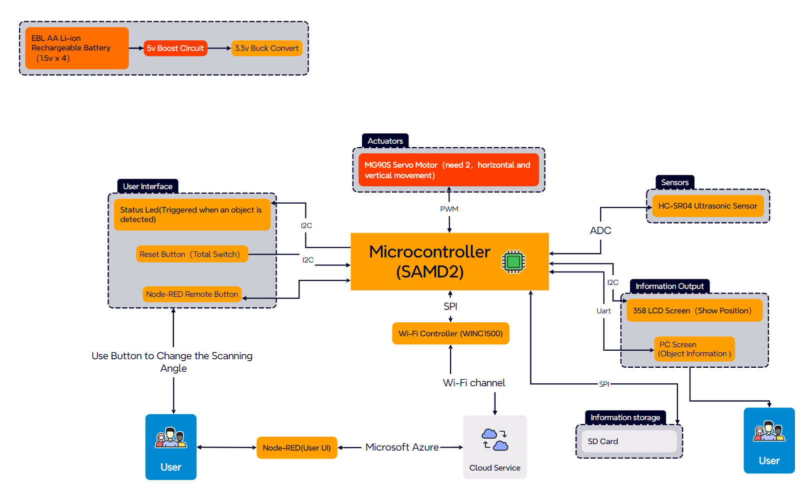

# a14g-final-submission

    * Team Number: 20
    * Team Name: Gold Rush
    * Team Members: Shijia Jiang and Chenyu Ye
    * Github Repository URL: 
    * Description of test hardware: (development boards, sensors, actuators, laptop + OS, etc) 

## 1. Video Presentation

## 2. Project Summary  

Our group is going to make an ultrasonic radar controlled by Node-RED dashboard detect objects 180 degree ahead. The equipment set up a 2-Dimension diagram to show the positions by circle and ranges of height by different color of surrounding objects on LCD, the data of distance, angle and height is shown on computer terminal via UART. The key technical problem is how to detect the edge of projects. To achieve that, we assume that when the distance sensor detects a mutation more than 10cm, then considered it as an edge, that is, to start detecting the object. To obtain height data, we set the horizontal servo back to the center of object and then enable the vertical servo to measure height by the same edge-detection method.  
For the internet, we can connect to our device via a remote VM to perform an OTAU upgrade of the device. At the same time, we can use the Node-RED dashboard remote control to select the motor and adjust the speed of motor rotation.  
Our project is inspired by the fact that we need a radar to assist us in detecting and locating in poor field of vision conditions. Our project enhances object detection in low-visibility environments, combining radar and edge detection technologies for autonomous driving and aiding the visually impaired. This approach improves orientation, distance, and size assessments of objects, providing a practical tool for better environmental understanding.  
  
For the associated external equipment, we have four main components. First is is the ultrasonic sensor, which uses the GPIO protocol.  Then, we use motor driver to drive two servo motors which connected to the PCB by I2C. And the two Servo motors carrying distance sensor for horizontal and vertical detection to obtain objects’ position and height data. Finally, LCD Screen will set up a 2-Dimension diagram showing the positions and ranges of surrounding objects by SPI.  
For the difficulties, we face many problems in both software and hardware. Firstly, we found a wire for the buck circuit was not designed properly while testing the PCB. The solution was to solder a wire from the outside so that the circuit could be powered properly. At the same time, there was a problem that the I2C protocol could not be used properly on the PCB we designed. We tried many methods and finally chose to use SAMW25 to complete the control of the motor driver. In the debugging of software and hardware, we found that the computer will recognize the two motors as two drivers, and can not select the motor through the Node-RED. We were ultimately unable to solve this problem and have explained it in the video.  
By building and testing this prototype, we learned to use different protocols such as SPI, I2C and Uart. We have also familiarized ourselves with the use of SolidWorks. In particular, we learned the logic of the FreeRTOS architecture. If we had to build this device again, we might choose to replace the current I2C driver due to the fact that it can't be recognized well by our computer side and pass back data.  
Our next step will be to improve the way the ultrasonic sensors work by switching to the Uart protocol for testing. At the same time, we will optimize our LCD display so that it can work and at the same time be able to perform the initially set detection tasks.

## 3. Hardware & Software Requirements

## 4. Project Photos & Screenshots
